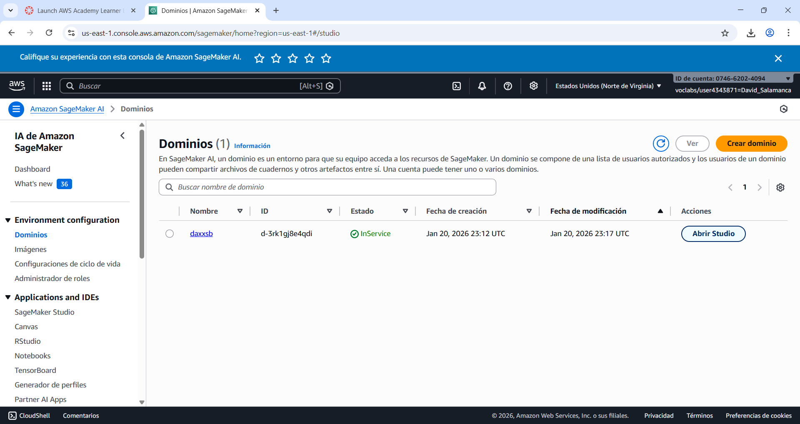
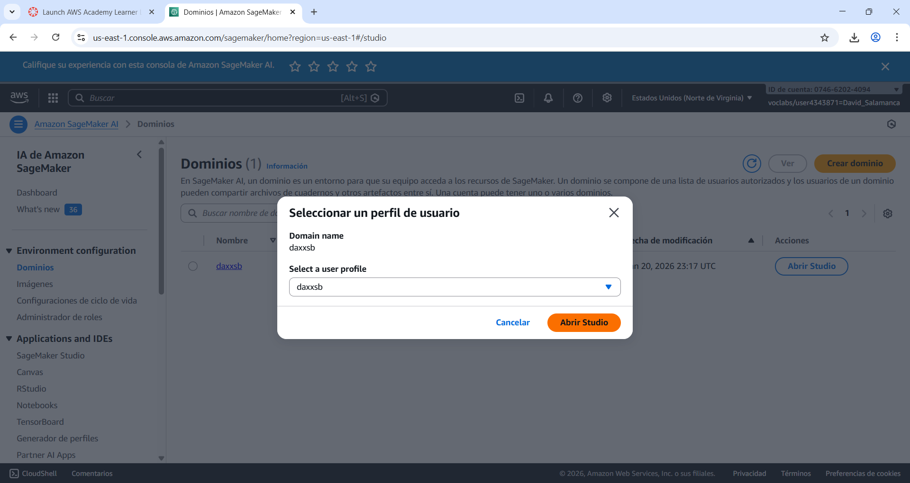
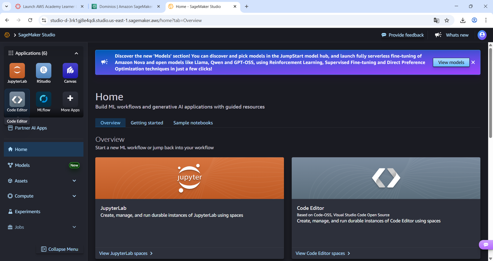
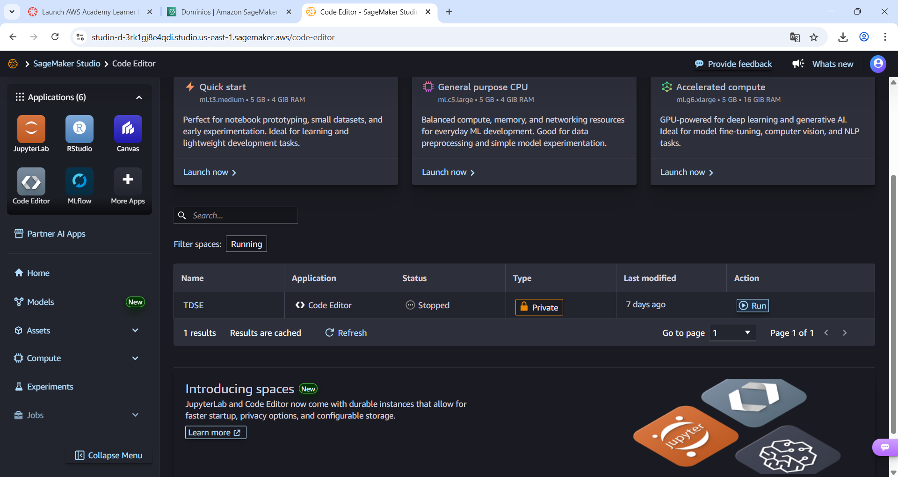
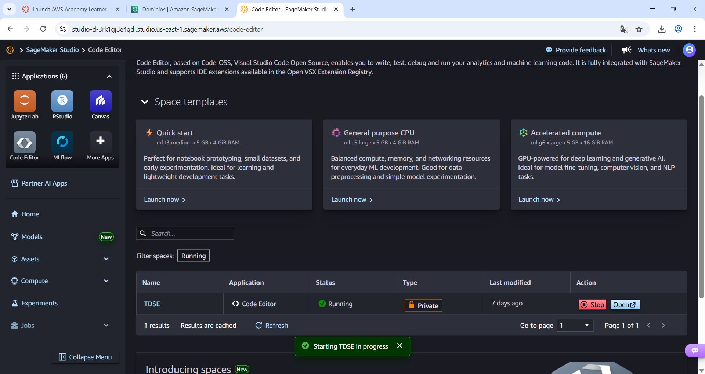
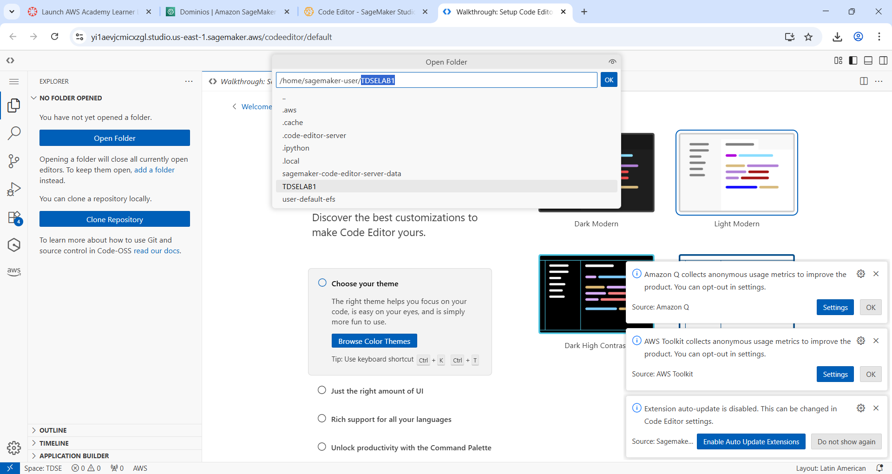
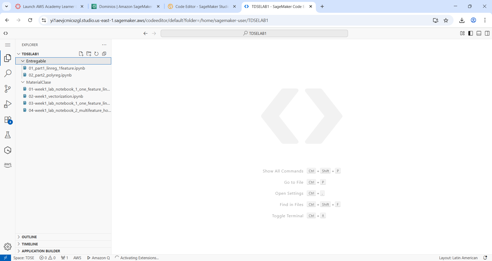
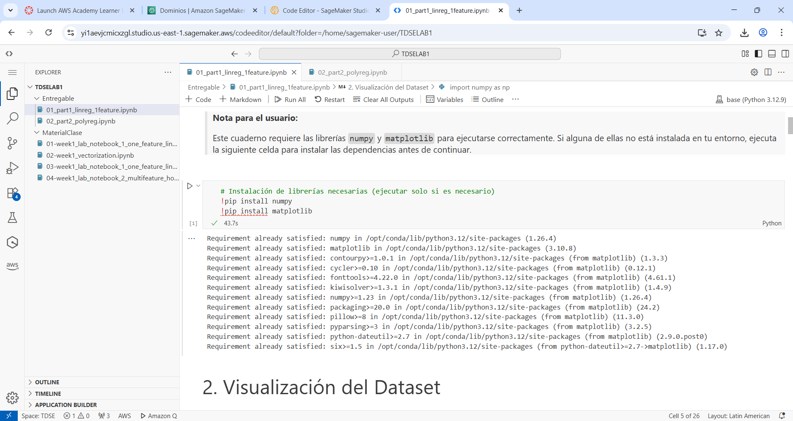
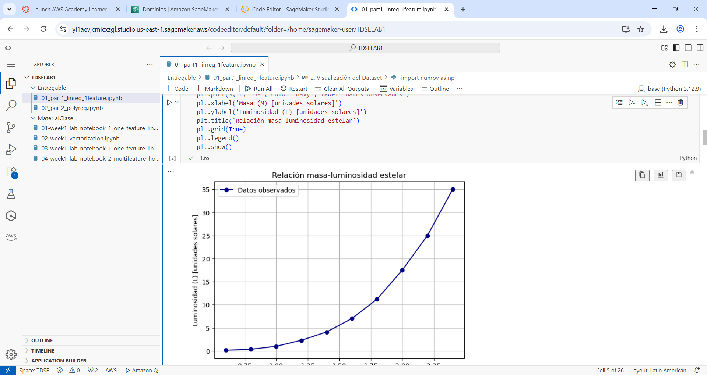
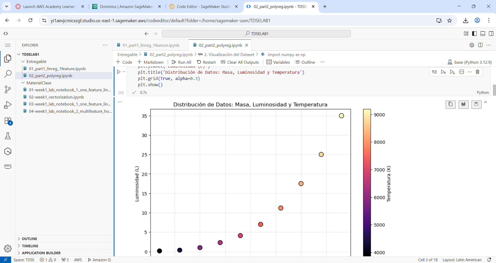

# Modelado de la Luminosidad Estelar mediante Regresión Lineal y Polinómica desde Primeros Principios

# Descripción General

El presente proyecto aborda el modelado de la luminosidad estelar en función de la masa y la temperatura superficial de las estrellas, empleando técnicas de regresión lineal y polinómica implementadas manualmente. El contexto astronómico motiva el estudio de la relación masa-luminosidad, fundamental para comprender la evolución y clasificación estelar. La motivación principal radica en construir modelos predictivos interpretables, partiendo de los fundamentos matemáticos y computacionales, sin recurrir a librerías de machine learning de alto nivel.

---

# Objetivos

**Objetivo general**

Desarrollar e implementar, desde primeros principios, modelos de regresión lineal y polinómica para predecir la luminosidad estelar a partir de variables físicas, utilizando únicamente Python, NumPy y Matplotlib.

**Objetivos específicos**

- Analizar la relación entre masa, temperatura y luminosidad estelar mediante visualización y modelado.
- Derivar e implementar manualmente los gradientes y el descenso por gradiente para el ajuste de parámetros.
- Explorar la ingeniería de características y la inclusión de términos polinómicos e interacciones.
- Evaluar la convergencia y el desempeño de los modelos bajo diferentes configuraciones.
- Comparar los resultados obtenidos y discutir su interpretación física y astronómica.

---

# Contexto Académico y Empresarial

Este proyecto se enmarca en el ámbito del bootcamp de Machine Learning y Arquitectura Empresarial, integrando conceptos de sistemas inteligentes y computación en la nube. La implementación manual de algoritmos fomenta la comprensión profunda de los fundamentos matemáticos, esenciales para el diseño de soluciones robustas en entornos empresariales. Además, la capacidad de desplegar y validar modelos en plataformas como AWS SageMaker ilustra la conexión entre la investigación académica, la transformación digital y la adopción de arquitecturas escalables en la industria.

---

# Estructura del Repositorio

```text
/
├── README.md
├── 01_part1_linreg_1feature.ipynb
└── 02_part2_polyreg.ipynb
```

El repositorio contiene dos cuadernos principales, cada uno dedicado a una técnica de regresión distinta, y este archivo README con la documentación integral del proyecto.

---

# Descripción de los Cuadernos

## 01_part1_linreg_1feature.ipynb

Este cuaderno desarrolla la regresión lineal simple para modelar la luminosidad estelar en función de la masa. Incluye:

- Definición y visualización del dataset astronómico.
- Formulación del modelo lineal y de la función de pérdida (MSE).
- Derivación explícita de los gradientes respecto a los parámetros.
- Implementación manual del descenso por gradiente, tanto no vectorizado como vectorizado.
- Experimentos con diferentes tasas de aprendizaje y análisis de convergencia.
- Evaluación del ajuste final y discusión sobre la interpretación física de los parámetros.

## 02_part2_polyreg.ipynb

Este cuaderno extiende el análisis a la regresión polinómica multivariable, incorporando términos cuadráticos e interacciones. Incluye:

- Ingeniería de características: masa, temperatura, masa al cuadrado e interacción masa-temperatura.
- Construcción de modelos M1, M2 y M3, con conjuntos de características crecientes.
- Implementación manual del descenso por gradiente para modelos polinómicos.
- Comparación de desempeño entre modelos y análisis de la importancia de los términos de interacción.
- Ejercicios de inferencia y análisis de sensibilidad de los parámetros.
- Discusión sobre la interpretación física y la capacidad predictiva de los modelos.

---

# Metodología

1. **Definición del modelo:** Se plantean modelos de regresión lineal y polinómica, especificando explícitamente las variables y términos incluidos.
2. **Función de pérdida:** Se utiliza el error cuadrático medio (MSE) como criterio de ajuste.
3. **Derivación matemática:** Se deducen manualmente los gradientes de la función de pérdida respecto a los parámetros del modelo.
4. **Implementación:** Todo el código se desarrolla desde cero, empleando únicamente Python, NumPy y Matplotlib, sin funciones automáticas de ajuste.
5. **Entrenamiento:** Se aplica descenso por gradiente, registrando el historial de la función de pérdida para analizar la convergencia.
6. **Evaluación:** Se comparan los modelos mediante métricas de error y visualización de los resultados, discutiendo la interpretación física de los parámetros aprendidos.

---

# Restricciones y Cumplimiento

- No se utilizaron librerías de machine learning de alto nivel (scikit-learn, statsmodels, tensorflow, pytorch, scipy, seaborn, ni optimizadores automáticos).
- No se emplearon funciones automáticas de ajuste como polyfit, lstsq u optimize.
- Todos los algoritmos, gradientes y rutinas de entrenamiento fueron implementados manualmente.
- Los datasets están definidos explícitamente en los cuadernos.

---

# Requisitos del Sistema

- Python (recomendado 3.8 o superior)
- Jupyter Notebook o JupyterLab
- NumPy
- Matplotlib
- Visual Studio Code o cualquier navegador web compatible

---

# Instrucciones de Ejecución

1. Clonar o descargar el repositorio en el entorno local.
2. Abrir los archivos `01_part1_linreg_1feature.ipynb` y `02_part2_polyreg.ipynb` en Jupyter Notebook, JupyterLab o Visual Studio Code con soporte para notebooks.
3. Ejecutar las celdas secuencialmente para reproducir los experimentos y visualizar los resultados.
4. Verificar la correcta instalación de las dependencias (NumPy y Matplotlib) antes de la ejecución.
5. Analizar los resultados y gráficos generados en cada sección.

---

# Resultados Principales

- Se observa la convergencia de los modelos bajo descenso por gradiente manual.
- Los parámetros aprendidos reflejan la relación física entre masa, temperatura y luminosidad.
- La comparación entre modelos lineales y polinómicos evidencia la mejora en el ajuste al incorporar términos no lineales e interacciones.
- Los resultados permiten interpretar la importancia relativa de cada variable y la validez física de las predicciones.

---


# AWS SageMaker Execution Evidence

El proyecto fue ejecutado exitosamente en AWS SageMaker, siguiendo el siguiente procedimiento:

- Los cuadernos fueron subidos a la instancia de SageMaker mediante la interfaz web.
- Se ejecutaron todas las celdas, verificando la correcta reproducción de los resultados obtenidos localmente.
- Se tomaron capturas de pantalla como evidencia del proceso y la ejecución satisfactoria.
- La comparación entre la ejecución local y en la nube confirmó la reproducibilidad y portabilidad del código.

## 1. Acceso y configuración del entorno

Se accedió a la consola de AWS SageMaker y se verificó la existencia de un dominio activo para el usuario, lo que garantiza que los recursos de SageMaker están correctamente aprovisionados y listos para su uso.


*Dominio activo en SageMaker Studio, con el dominio y usuario configurados correctamente.*

Posteriormente, se seleccionó el perfil de usuario adecuado y se procedió a abrir SageMaker Studio, lo que permite acceder a las herramientas de desarrollo y ejecución de notebooks en la nube.


*Selección del perfil de usuario antes de iniciar SageMaker Studio.*

## 2. Inicio de SageMaker Studio y selección de aplicaciones

Una vez dentro de SageMaker Studio, se visualizó la interfaz principal, donde se encuentran disponibles aplicaciones como JupyterLab, Code Editor, RStudio y Canvas. Esta vista permite gestionar flujos de trabajo de machine learning y acceder a los recursos del entorno.


*Interfaz principal de SageMaker Studio con acceso a las aplicaciones de desarrollo.*

Se seleccionó el Code Editor, basado en Visual Studio Code, para gestionar los archivos y cuadernos del proyecto, aprovechando su integración con el entorno de AWS.


*Selección y arranque del Code Editor en SageMaker Studio.*

## 3. Carga y apertura del repositorio

En el Code Editor, se abrió la carpeta del proyecto, permitiendo visualizar la estructura de directorios y los archivos entregables. Se verificó la presencia de los notebooks requeridos para la entrega.


*Carpeta del proyecto abierta en Code Editor, lista para la ejecución de los notebooks.*

## 4. Ejecución de los notebooks

Se abrieron ambos cuadernos y se ejecutaron todas las celdas secuencialmente. Se verificó la correcta instalación de dependencias, la ejecución sin errores y la generación de resultados y gráficos esperados.


*Ejecución de notebook 01_part1_linreg_1feature.ipynb en SageMaker Studio.*


*Ejecución de notebook 02_part2_polyreg.ipynb en SageMaker Studio.*

## 5. Comparación local vs nube

Los resultados obtenidos en AWS SageMaker Studio fueron equivalentes a los obtenidos en el entorno local, demostrando la portabilidad y robustez del código. No se presentaron errores ni incompatibilidades durante la ejecución en la nube, y todos los experimentos y visualizaciones se reprodujeron satisfactoriamente.

---

# Nota Académica

Este proyecto fue desarrollado con fines exclusivamente educativos en el marco del bootcamp de Machine Learning y Arquitectura Empresarial de la Escuela Colombiana de Ingeniería Julio Garavito. El código y los materiales pueden ser reutilizados citando la fuente y respetando las normas de la institución.

---

# Autoría

- **Estudiante:** David Eduardo Salamanca Aguilar
- **Profesor:** Luis Daniel Benavides Navarro
- **Universidad:** Escuela Colombiana de Ingeniería Julio Garavito

---

# Discusión

El proyecto demuestra la viabilidad de implementar modelos de regresión desde primeros principios, permitiendo un control total sobre el proceso de entrenamiento y la interpretación de los resultados. Las limitaciones principales residen en la simplicidad de los modelos y la ausencia de regularización, lo que puede afectar la generalización. Físicamente, los modelos capturan la tendencia general de la relación masa-luminosidad, aunque la naturaleza no lineal y la dispersión de los datos sugieren la necesidad de modelos más complejos para aplicaciones astrofísicas avanzadas.

---

# Conclusiones

La implementación manual de regresión lineal y polinómica proporciona una comprensión profunda de los fundamentos matemáticos y computacionales del aprendizaje supervisado. El análisis realizado evidencia la importancia de la ingeniería de características y la interpretación física de los parámetros. El proyecto refuerza la conexión entre la teoría, la práctica y la aplicabilidad en contextos empresariales y científicos, sentando las bases para el desarrollo de soluciones más avanzadas en sistemas inteligentes y arquitecturas en la nube.

---

# Referencias

- Notebooks guía proporcionados en la sesiones de laboratorio
- Documentación oficial de NumPy: https://numpy.org/doc/
- Documentación oficial de Matplotlib: https://matplotlib.org/stable/contents.html

